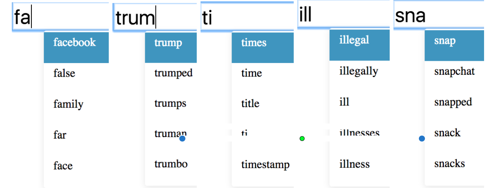
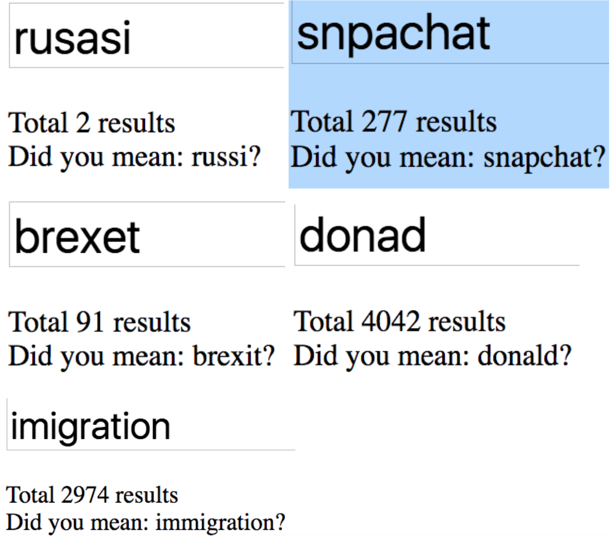
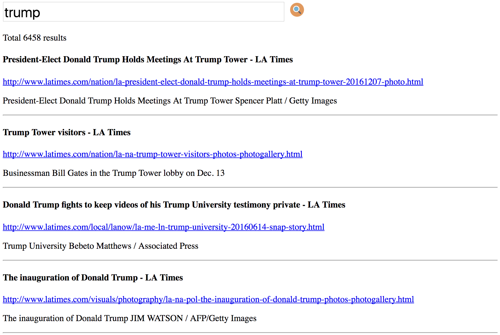

# LATimes-search-engine-website
## Summary
* It is a course module from CSCI 572.
* It is a search engine website using **ReactJS** based front-end, **NodeJS** based backend and **Apache Solr** service as search engine.
* Crawl 2GB data from LATimes using **Crawler4j**, using **Apache Tika** to parse crawled html data to text. Use Solr to build index,
store data and support full-text search.
* Implemented **autosuggestions**, search result **snippet** using customerized React component and **Bootstrap**. Implemented **spell correction**
in JavaScript.

The project will continue to updata:
Incoming new update:
* Add **Redis** for in-memory speed-up search. Add **MongoDB** for durable storage.
* Migrate data from Apache Solr to **Elasticsearch** to support distributed search and larger dataset.
* Optimize front-end UI.

### Autocomplete: 

### Spell correction:

### Search result:

